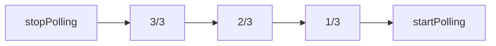

<p align="center">

</p>

# neutralino-ext-rust
**A Rust Extension for Neutralino >= 5.0.0**

This extension adds a Rust backend to Neutralino with the following features:
- Requires only a few lines of code on both ends.
- Read all events from the Neutralino app in your Rust code.
- Run Rust functions from Neutralino.
- Run Neutralino functions from Rust.
- All communication between Neutralino and Rust runs asynchronously.
- All events are queued, so none will be missed during processing.
- Track the data flow between Neutralino and Rust in realtime.
- Works in Window- and headless Cloud-Mode.
- Terminates the Rust Runtime when the Neutralino app quits.


## Run the demo
The demo opens a Neutralino app. Clicking on the blue link sends a Ping to Rust, which replies with Pong.
This illustrates the data-flow in both directions. 

Before running the demo, the Rust extension needs to be compiled with Rust. Make this folder the project root for your 
Rust-compiler:
```bash
/extensions/rust
```
Then build with:
```bash
cargo build --release
```
The demo is configured to launch the Rust-extension binary directly from its build-target's release folder.

After this, run these commands in the **ext-rust** folder:
```commandline
neu update
neu run
```

## Integrate into your own project
Follow these steps:
- Adapt the Rust code in **extensions/rust/main.rs** to your needs.
- Build the Rust-binary.
- Create an empty **/extensions/rust** folder, used by your installer.
- Copy the Rust-binary to **/extensions/rust**
- Copy this **/extensions** folder to your project.
- Copy **resources/js/rust-extension.js** to **resources/js**.
- Add `<script src="js/rust-extension.js"></script>` to your **index.html**
- Add `const RUST = new RustExtension(true)` to your **main.js**
- Add **RUST.run(function_name, data) to main.js** to run Rust-functions from Neutralino.
- Add **event listeners to main.js**, to fetch result data from Rust.
- Modify **neutralino.config.json** (see below).

Make sure that **neutralino.config.json** contains this whitelist:
```json
  "nativeAllowList": [
    "app.*",
    "os.*",
    "window.*",
    "events.*",
    "extensions.*",
    "debug.log"
  ],
```

## ./extensions/rust/main.rs explained

```js
mod neutralino;

const DEBUG_EXT_RUST: bool = true;

fn process_app_event(ext: &mut neutralino::Extension, d: &mut serde_json::Value) {

    if ext.is_event(d, "runRust") {
        let data = ext.get_data(d);

        if data["function"].as_str().unwrap() == "ping" {
            let p = data["parameter"].as_str().unwrap();

            let msg = format!("Rust says PONG in reply to '{}'", &p);
            ext.send_message("pingResult", &msg);
        }
    }
}

fn main() {
    let mut ext = neutralino::Extension::new();
    ext.run(process_app_event);
}

```

The extension is activated in main(). 
**process_app_event** is a callback function, which is triggered with each event coming from the Neutralino app.

In the callback function, you can process the incoming events by their name. In this case we react to the **"runRust"** event.
**data["function"]** holds the requested Rust-function and **data["parameter"]** its data payload as JSON.

If the requested function is named **ping**, we send back a message to the Neutralino frontend. 

**send_message()** requires the following parameters:
- An event name, here "pingResult"
- The data package to send, which can be a string or stringified JSON.

The **DEBUG_EXT_RUST** constant tells the NeutralinoExtension to report each event to the console. Incoming and outgoing messages are printed in different colors.

This makes debugging easier, since you can track the data flow between Neutralino and Rust:


## ./resources/js/main.js explained

```JS

async function onPingResult(e) {
...
}

// Init Neutralino
//
Neutralino.init();
...
Neutralino.events.on("pingResult", onPingResult);
...
// Init Bun Extension
const RUST = new RustExtension(true)
```

The last line initializes the JavaScript part of the Rust-extension. It's important to place this after Neutralino.init() and after all event handlers have been installed. Put it in the last line of your code and you are good to go. The const **RUST** is accessible globally.

The **RustExtension class** takes only 1 argument which instructs it to run in debug mode (here true). In this mode, all data coming from the extension is printed to the dev-console:


The **pingResult event handler** listens to messages with the same name, sent by send_message() on Rust's side. 

In **index.html**, you can see how to send data from Neutralino to Rust, which is dead simple:
```html
<a href="#" onclick="RUST.run('ping', 'Neutralino says PING!');">Send PING to Rust</a><br>
```

**RUST.run()** takes 2 arguments:
- The Bun function to call, here "ping"
- The data package to submit, either as string or JSON.

Below this link, you see
```html
<a id="link-quit" href="#" onclick="RUST.stop();" style="display:none">Quit</a>
```
**RUST.stop()** is only required, when running Neutralino in cloud-mode. This will unload the RUST-extsension gracefully.

### Long-running tasks and their progress

For details how to start a long-running background task in Rust and how to poll its progress,
see the comments in `extensions/rust/main.rs`and `resources/js/main.js`.

Event messages of these tasks are stored in a separate queue. The first message triggers **startPolling**
in the frontend, the last message triggers **stopPolling**. The progress messages are in between:



The incoming **poll-event** from the frontend forces Rust to stop listening on the WebSocket and processing 
the queue instead.

## Modules & Classes Overview

### neutralino.rs (Rust)

| Variable/Struct | Description                                                             |
|-----------------|-------------------------------------------------------------------------|
| DEBUG_EXT_RUST  | Log debug messages to stdout, if true.                                  |
| EventMessage    | **event**: Event-name, **data**: Payload as string or stringified JSON. |

| Method | Description                                                                                       |
|-------|---------------------------------------------------------------------------------------------------|
| new() | Create a new Extension struct instance.                                                           |
| run(callback) | Starts the extensions main processing loop. Each incoming message triggers the callback function. |
| is_event(d, e) | Checks the incoming event data package (d) for a particular event-name (e).                       |
| get_data(d) | Extracts a JSON data payload from the data packet's (d) `data` field.                             |
| send_message(e, d) | Send a message to Neutralino. e: Event-name, d: Data package as string or stringified JSON.       |

### rust-extension.js

| Method                    | Description                                                                                     |
|---------------------------|-------------------------------------------------------------------------------------------------|
| RustExtension(debug=false) | Extension class. debug: Print data flow to the dev-console.                                     |
| async run(f, p=null)      | Call a Rust-function. f: Function-name, p: Parameter data package as string or JSON.            |
| async stop()              | Stop and quit the Rust-extension and its parent app. Use this if Neutralino runs in Cloud-Mode. |

## More about Neutralino
- [NeutralinoJS Home](https://neutralino.js.org) 

- [Neutralino Build Automation for macOS, Windows, Linux](https://github.com/hschneider/neutralino-build-scripts)

- [Neutralino related blog posts at marketmix.com](https://marketmix.com/de/tag/neutralinojs/)


